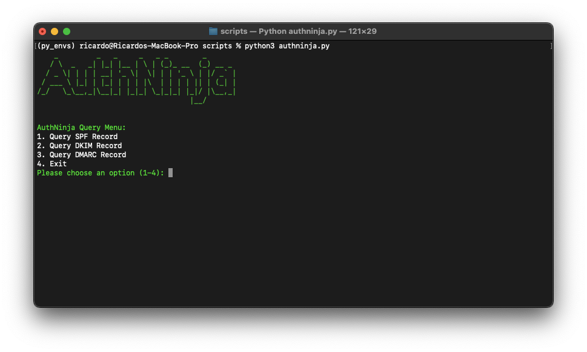
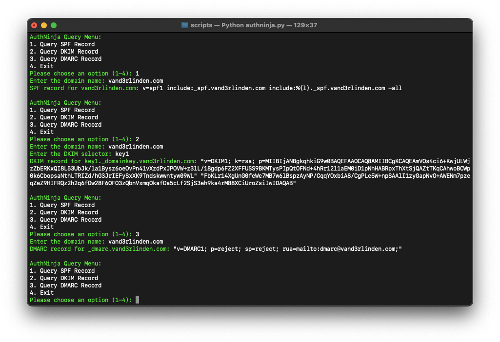

**AuthNinja** is a tool designed to quickly check outbound email authentication settings such as SPF, DKIM, and DMARC directly from the terminal. Verify your email security effortlessly with just a few commands.

## Required Python packages
- `requests`: `python3 -m pip install requests`
- `pyfiglet` and `colorama`: `python3 -m pip install pyfiglet colorama`
- `dnspython`: `python3 -m pip install dnspython`

## Start AuthNinja
1. Place `authninja.py` in a local folder, such as your Python virtual environment: `~/py_envs/scripts`.
2. Enable your virtual Python environment: `source ~/py_envs/bin/activate`
3. Browse to the path: `cd py_envs/scripts`
4. Start AuthNinja: `python3 authninja.py`

## AuthNinja demo
### Menu:

### Query results:

