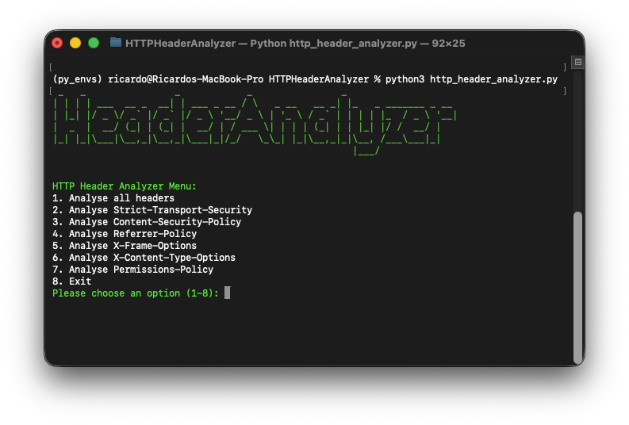

## Required Python packages
- `requests`: `python3 -m pip install requests` 
- `pyfiglet`: `python3 -m pip install pyfiglet` 

## Start the HTTPHeaderAnalyzer
1. Place `http_header_analyzer.py` in a local folder, such as your [Python virtual environment](https://github.com/vand3rlinden/Python?tab=readme-ov-file#installation-of-python): `~/py_envs/scripts`
2. Enable your virtual Python environment: `source ~/py_envs/bin/activate`
3. Browse to the path: `cd py_envs/scripts`
4. Start **Start the HTTPHeaderAnalyzer**: `python3 http_header_analyzer.py`

## HTTPHeaderAnalyzer demo
### Menu:
