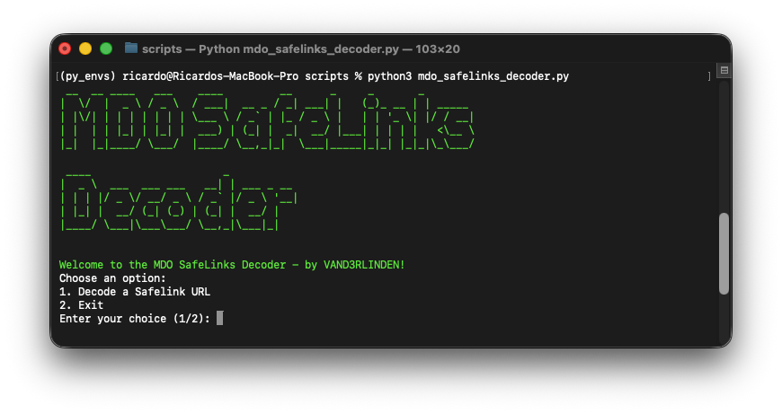

**MDO SafeLinks Decoder** is created to decode SafeLinks URLs locally without using any online third-party tools. Since most SafeLinks URLs contain the user’s UPN, it is not confidential to decode them through online third-party tools. 

Decoding SafeLinks URLs is sometimes necessary when investigating a link. However, if you copy and paste a SafeLinks URL received from a user into your sandbox, a URL click event will be logged in the `UrlClickEvents` table in Advanced Hunting under your IP address and the user’s account name. If the URL is potentially malicious, this could trigger a URL click incident for that user.

## Required Python packages
- `pyfiglet`: `python3 -m pip install pyfiglet` 
  - Only for the ASCII art, you can remove the banner from the `main_menu` section in the `.py` file if you want
    - Remove lines: 3, 23 and edit line 24

## Start MDO SafeLinks Decoder
1. Place `mdo_safelinks_decoder.py` in a local folder, such as your [Python virtual environment](https://github.com/vand3rlinden/Python?tab=readme-ov-file#installation-of-python): `~/py_envs/scripts`
2. Enable your virtual Python environment: `source ~/py_envs/bin/activate`
3. Browse to the path: `cd py_envs/scripts`
4. Start **MDO SafeLinks Decoder**: `python3 mdo_safelinks_decoder.py`

## MDO SafeLinks Decoder Menu
