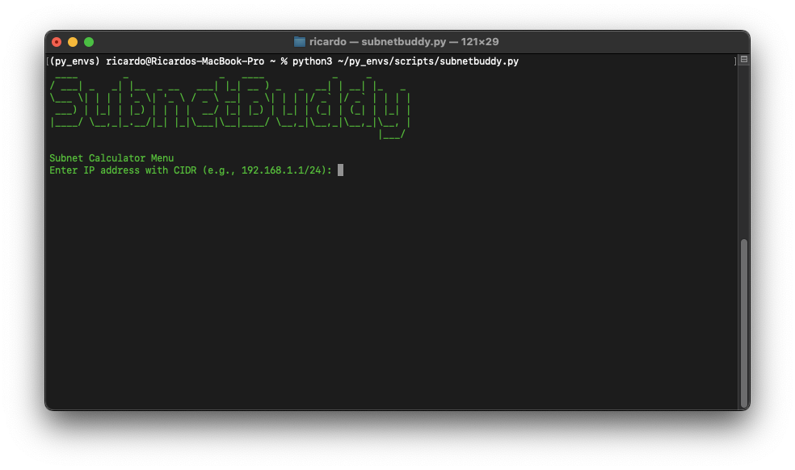
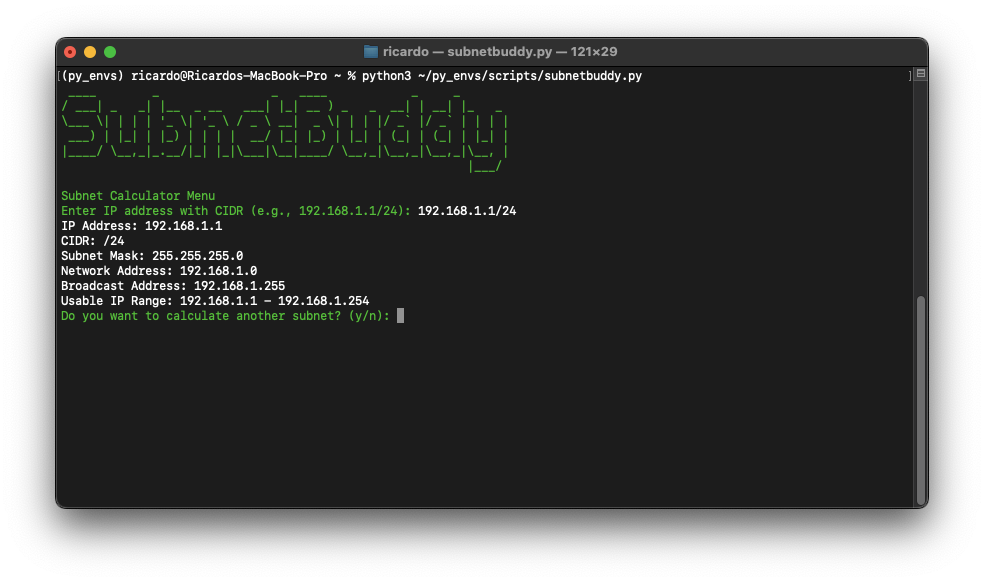

**SubnetBuddy** is a tool that simplifies and streamlines the process of calculating subnets. Whether you're a network engineer, system administrator, or working in cybersecurity, SubnetBuddy provides an intuitive interface for calculating subnets, subnet masks, and IP ranges with ease.

## Required Python packages
- `pyfiglet` and `colorama`: `python3 -m pip install pyfiglet colorama`

## Start 
1. Place `SubnetBuddy.py` in a local folder, such as your Python virtual environment: `~/py_envs/scripts`.
2. Enable your virtual Python environment: `source ~/py_envs/bin/activate`
3. Browse to the path: `cd py_envs/scripts`
4. Start SubnetBuddy: `python3 subnetBuddy.py`

## SubnetBuddy demo
### Menu:

### Subnet calculation results:
