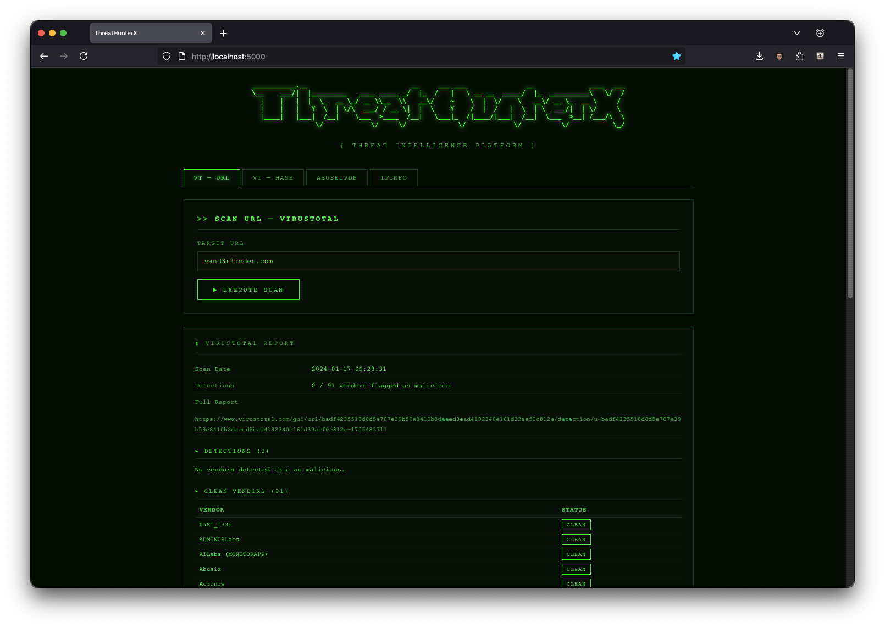

**ThreatHunterX-Flask** is a local browser tool designed to assist SOC analysts. The primary goal of **ThreatHunterX-Flask** is the same as the terminal application of [ThreatHunterX](https://github.com/vand3rlinden/Python/tree/main/ThreatHunterX): to free up time for SOC analysts by bringing all tools together into one session.

## Requirements
1. API Key for VirusTotal 
2. API Key for AbuseIPDB
3. API Key for IPInfo
4. Python packages: 
   - `requests`: `python3 -m pip install requests`
   - `flask`: `python3 -m pip install flask`
   - `python-dotenv`: `python3 -m pip install python-dotenv`

## API Key for VirusTotal 
You can register on [VirusTotal](https://www.virustotal.com/gui/join-us) to get a **free** API key with the following limits:
- Request rate: 4 lookups / min
- Daily quota: 500 lookups / day
- Monthly quota: 15.5 K lookups / month
- [API documentation](https://docs.virustotal.com/reference/overview)

## API Key for AbuseIPDB
You can register on [AbuseIPDB](https://www.abuseipdb.com/register?plan=free) to get a **free** API key with the following limits:
- Daily Limit: 1000 checks
- [API documentation](https://docs.abuseipdb.com)

## API Key for IPInfo
You can register on [IPInfo](https://ipinfo.io/pricing) to get a **free** API key with the following limits:
- Monthly Requests: Unlimited, but limited API Responses
- [API documentation](https://ipinfo.io/developers)

## Start ThreatHunterX
1. Copy the below content to a new file called `.env` and fill in your API keys inside the **ThreatHunterX-Flask** folder:
```
VIRUSTOTAL_API_KEY=your_virustotal_api_key
ABUSEIPDB_API_KEY=your_abuseipdb_api_key
IPINFO_API_KEY=your_ipinfo_api_key
```
2. Place the **ThreatHunterX-Flask** folder into your [Python virtual environment](https://github.com/vand3rlinden/Python?tab=readme-ov-file#installation-of-python) scripts folder: `~/py_envs/scripts`.
3. Enable your virtual Python environment: `source ~/py_envs/bin/activate`
4. Browse to the path: `cd py_envs/scripts/ThreatHunterX-Flask`
5. Start ThreatHunterX-Flask: `python3 threathunterx-flask.py`
6. Open `http://localhost:5000` in your browser

## ThreatHunterX-Flask Menu
