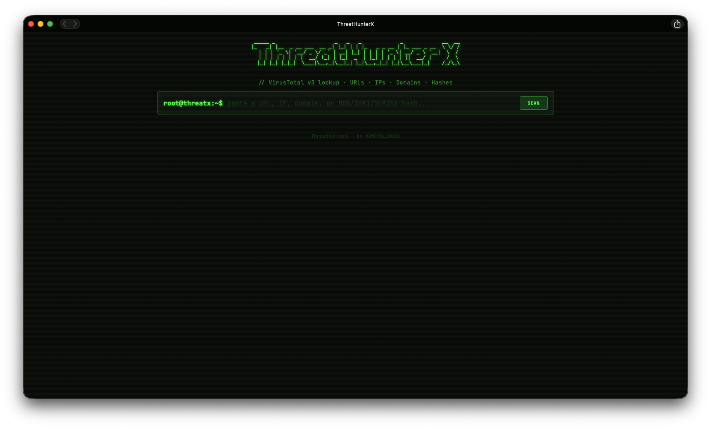

# ThreatHunterX

A terminal-styled web app for looking up URLs, IP addresses, domains, and file
hashes against the [VirusTotal](https://www.virustotal.com/) v3 API. One
search bar, auto-detects what you pasted in, and shows detection stats,
per-engine results, and type-specific details (WHOIS/DNS for domains, ASN/geo
for IPs, final URL/title for URLs, file metadata for hashes).

The VirusTotal API key lives server-side only, in a `.env` file the Flask
backend reads. The browser never sees it, the frontend only ever talks to
this app's own `/api/lookup` endpoint.



## Setup

1. **Get a VirusTotal API key**: https://www.virustotal.com/gui/my-apikey
   (the free-tier key works fine, free tier is limited to 4 requests/min).

2. **Create your `.env` file** in the project root (next to this README):

   ```bash
   cp .env.example .env
   ```

   Then edit `.env` and set:

   ```
   VT_API_KEY=your_actual_key_here
   ```

   `.env` is git-ignored, so your key won't get committed.

3. **Install dependencies** (Python 3.9+ recommended):

   ```bash
   python3 -m venv .venv
   source .venv/bin/activate        # Windows: .venv\Scripts\activate
   pip install -r backend/requirements.txt
   ```

## Run it

```bash
python3 backend/app.py
```

Then open http://127.0.0.1:5000 in your browser.

## Security notes

- The API key is only ever read in `backend/vt_client.py` calls made from the
  server, it is never included in any response sent to the browser.
- Everything VirusTotal returns is treated as untrusted: the backend
  (`normalize.py`) whitelists and length-caps fields before they leave the
  server, and the frontend (`app.js`) only ever writes that data into the DOM
  via `textContent`, never `innerHTML`, so nothing VT returns can execute as
  markup or script.
</content>
