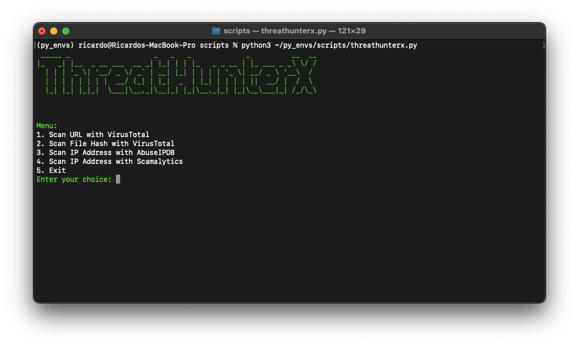
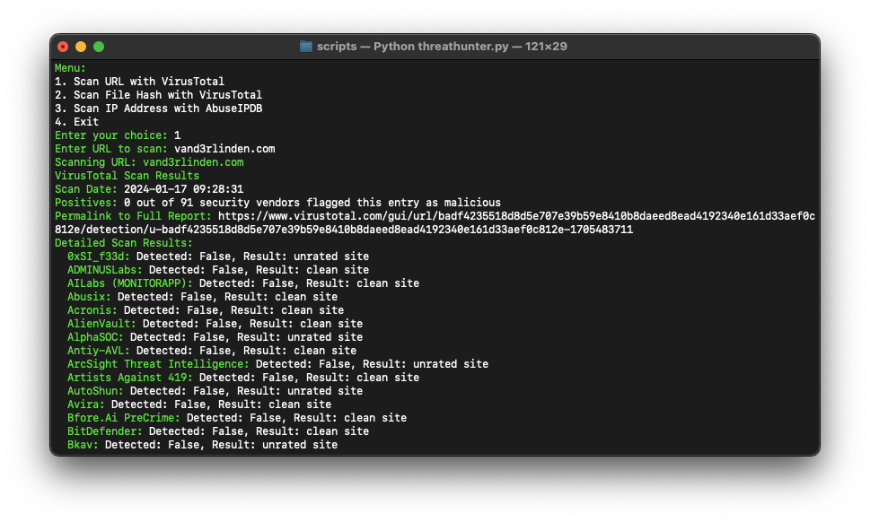
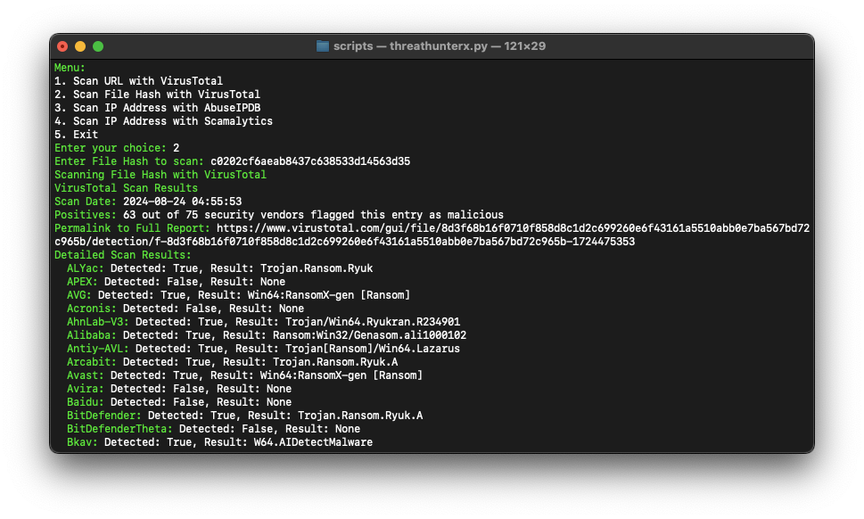
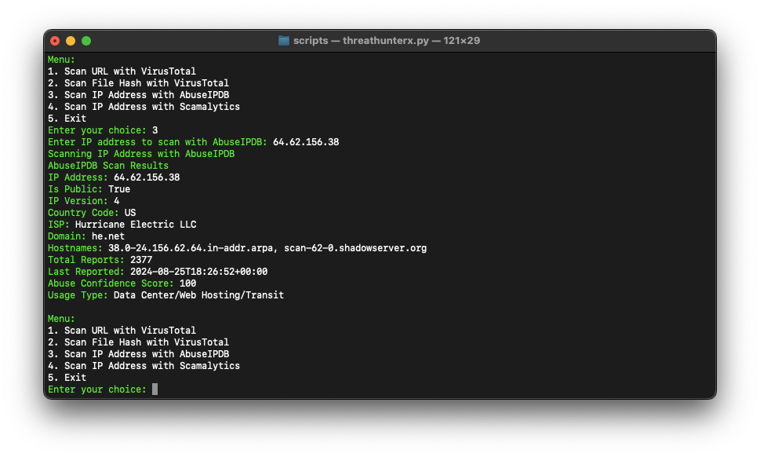
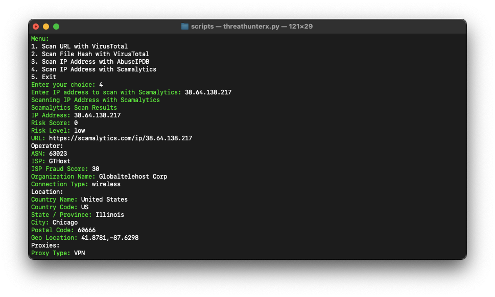

**ThreatHunterX** is a tool designed to assist SOC Analysts. The primary goal of **ThreatHunterX** is to perform routine checks and free up time for more in-depth analysis.

## Requirements
1. API Key for VirusTotal 
2. API Key for AbuseIPDB
3. API Key for Scamalytics
4. Python packages: 
   - `requests`: `python3 -m pip install requests`
   - `pyfiglet` and `colorama`: `python3 -m pip install pyfiglet colorama`

## API Key for VirusTotal 
You can register with [VirusTotal](https://www.virustotal.com/gui/join-us) to get a **free** API key with the following limits:
- Request rate: 4 lookups / min
- Daily quota: 500 lookups / day
- Monthly quota: 15.5 K lookups / month

## API Key for AbuseIPDB
You can register with [AbuseIPDB](https://www.abuseipdb.com/register?plan=free) to get a **free** API key with the following limits:
- Daily Limit: 1000 checks

## API Key for Scamalytics
You can register with [Scamalytics](https://scamalytics.com/ip/api/enquiry?monthly_api_calls=5000) to get a **free** API key with the following limits:
- Monthly Requests: 5000

## Start ThreatHunterX
1. Place `threathunterx.py` in a local folder, such as your Python virtual environment: `~/py_envs/scripts`.
2. Enable your virtual Python environment: `source ~/py_envs/bin/activate`
3. Browse to the path: `cd py_envs/scripts`
4. Start ThreatHunterX: `python3 threathunterx.py`

## ThreatHunterX demo
### Menu:

### URL Scan:

### FileHash Scan:

### IP Scans:
- AbuseIPDB:

- Scamalytics:

