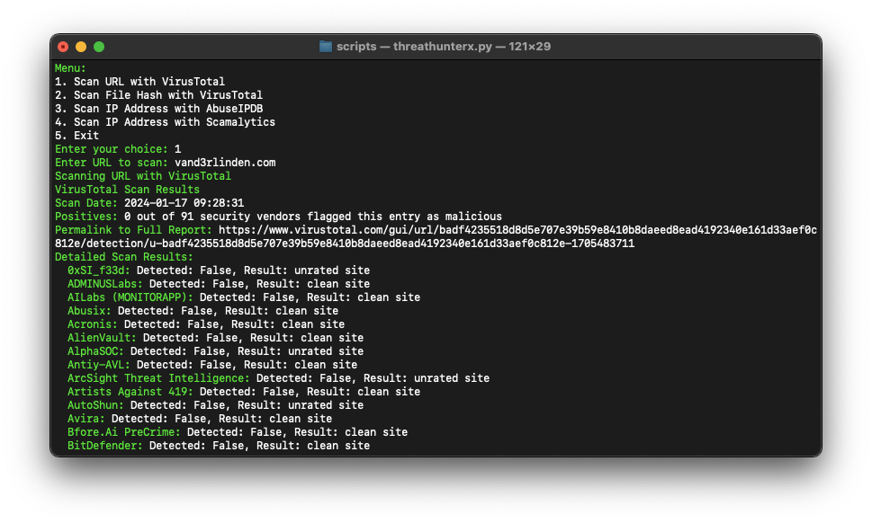

# Overview
ThreatHunterX is a tool designed to assist SOC analysts. The primary goal of ThreatHunterX is to perform routine checks and free up analyst time for more in-depth analysis in the same timeframe.

## Requirements
1. API Key for VirusTotal 
2. API Key for AbuseIPDB 
3. Python packages `requests`: `python3 -m pip install requests`

## API Key for VirusTotal 
You can register with [VirusTotal](https://www.virustotal.com/gui/join-us) to get a free API key with the following limits:
- Request rate: 4 lookups / min
- Daily quota: 500 lookups / day
- Monthly quota: 15.5 K lookups / month

## API Key for AbuseIPDB
You can register with [AbuseIPDB](https://www.abuseipdb.com/register?plan=free) to get a free API key with the following limits:
- Daily Limit: 1000 checks

## Start ThreatHunter
1. Place `threathunterx.py` in a local folder, such as your Python virtual environment: `~/py_envs/scripts`.
2. Enable your virtual Python environment: `source ~/py_envs/bin/activate`
3. Browse to the path: `cd py_envs/scripts`
4. Start ThreatHunter: `python3 threathunterx.py`

## ThreatHunterX demo
#### URL Scan:

#### FileHash Scan:

#### IP Scan:

